# Research Architecture Diagrams

These diagrams describe the current Research workspace, its independently versioned repositories, the running `iconium` services, and the workflows that turn discovered research into the published `wikip.co` site.

The YAML specifications in [`specs/`](specs/) are the editable sources. The committed SVGs are the preferred documentation format; matching PNGs are included for tools that do not render SVG. Runtime status was observed on `iconium` on 2026-08-09 and is a point-in-time annotation, not an architectural invariant.

## System and workflow views

### Project repository ecosystem

Ownership and data flow across `Research`, `research-tools`, `content`, `wikip.co`, and `public`, including GitHub, Cloudflare Pages, Docker Hub, Cloudinary, Gmail, and Google Scholar.

[Open SVG](rendered/project-repository-ecosystem.svg) · [Open PNG](rendered/project-repository-ecosystem.png) · [Edit specification](specs/project-repository-ecosystem.yaml)

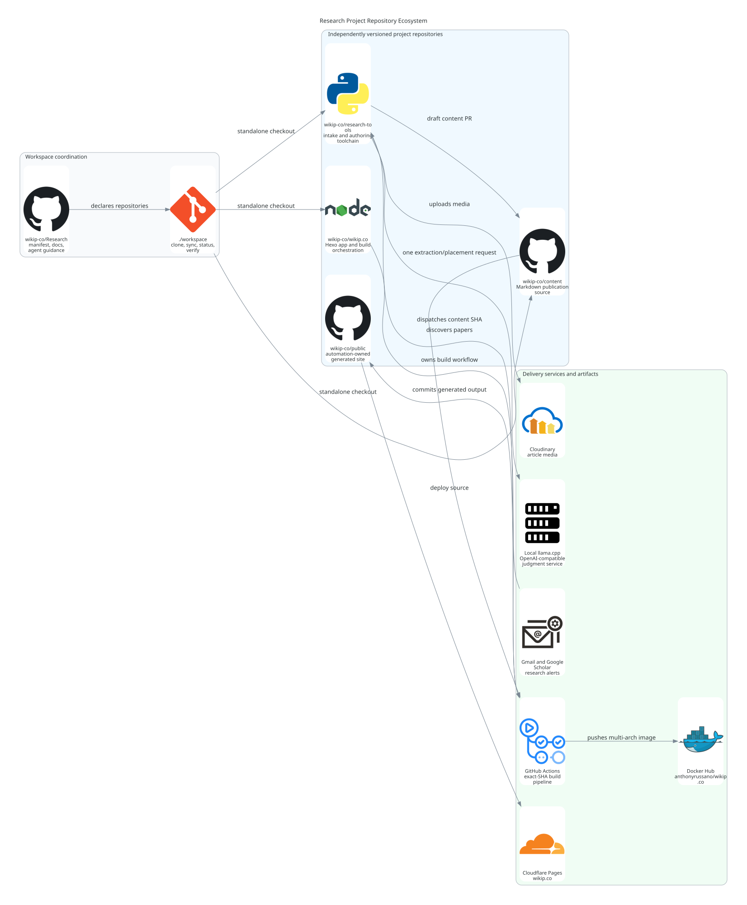

### Ideal end-to-end research workflow

The preferred path from alert ingestion and human triage through evidence extraction, content review, an exact-SHA site build, and production deployment.

[Open SVG](rendered/ideal-end-to-end-research-workflow.svg) · [Open PNG](rendered/ideal-end-to-end-research-workflow.png) · [Edit specification](specs/ideal-end-to-end-research-workflow.yaml)

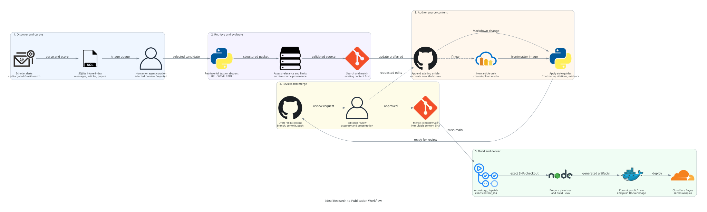

### Local publisher production flow

The implemented ad-hoc and passive intake paths through deterministic scraping/matching, local-model draft and critic passes, hard quality gates, isolated content worktrees, draft PR review, and downstream deployment.

[Open SVG](rendered/local-publisher-production-flow.svg) · [Open PNG](rendered/local-publisher-production-flow.png) · [Edit specification](specs/local-publisher-production-flow.yaml)

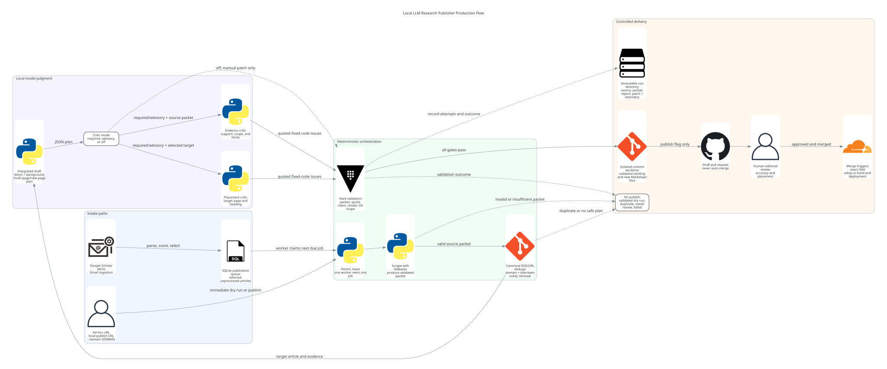

### Scraper packet validation

How original and canonical URLs move through Scrapling, FlareSolverr, and agent-browser; why every response is checked for fatal pages; and how metadata enrichment is accepted only after title/DOI consistency checks.

[Open SVG](rendered/scraper-packet-validation.svg) · [Open PNG](rendered/scraper-packet-validation.png) · [Edit specification](specs/scraper-packet-validation.yaml)

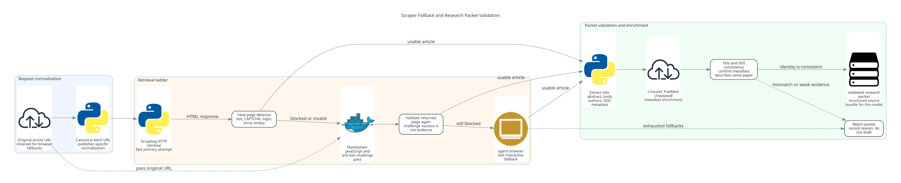

### Local publisher quality gates

The fail-closed sequence for packet sufficiency, source identity, duplicate detection, placement, near-verbatim quotation, claim strength, critic review, style, rendering, and Git scope.

[Open SVG](rendered/local-publisher-quality-gates.svg) · [Open PNG](rendered/local-publisher-quality-gates.png) · [Edit specification](specs/local-publisher-quality-gates.yaml)

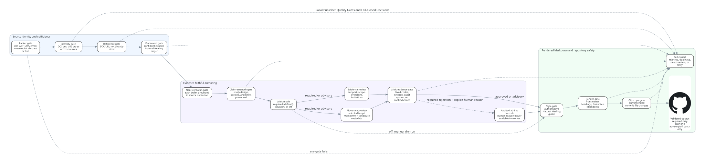

### Flat local development and build-fetch model

How a developer clones the coordinator, materializes standalone sibling repositories, verifies their Git boundaries, and prepares ignored content and output directories for a local Hexo build.

[Open SVG](rendered/local-development-build-fetch.svg) · [Open PNG](rendered/local-development-build-fetch.png) · [Edit specification](specs/local-development-build-fetch.yaml)

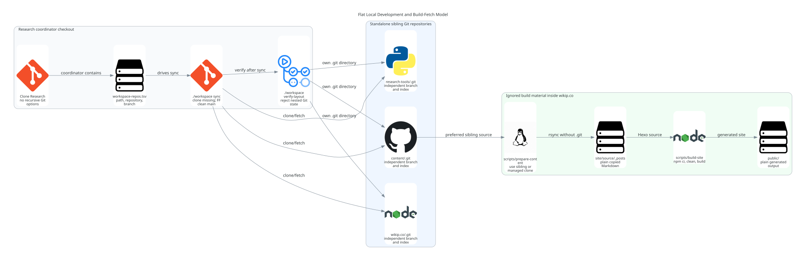

### Exact-SHA content publishing pipeline

The implemented GitHub Actions handoff from `content/main` to an isolated `wikip.co` build, generated `public` history, Cloudflare Pages, and the multi-architecture Docker image.

[Open SVG](rendered/cicd-exact-sha-publishing.svg) · [Open PNG](rendered/cicd-exact-sha-publishing.png) · [Edit specification](specs/cicd-exact-sha-publishing.yaml)

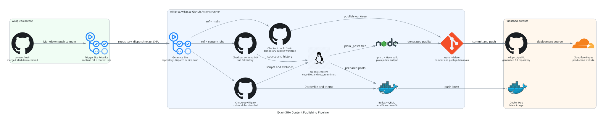

### Iconium runtime and data topology

The currently observed local services and data boundaries: triage and legacy Codex jobs, the local publisher and llama.cpp runtime, SQLite primary database, nightly backup timer, tracked-but-disabled automation timers, FlareSolverr, credentials, external APIs, and NAS backup target.

[Open SVG](rendered/iconium-runtime-topology.svg) · [Open PNG](rendered/iconium-runtime-topology.png) · [Edit specification](specs/iconium-runtime-topology.yaml)

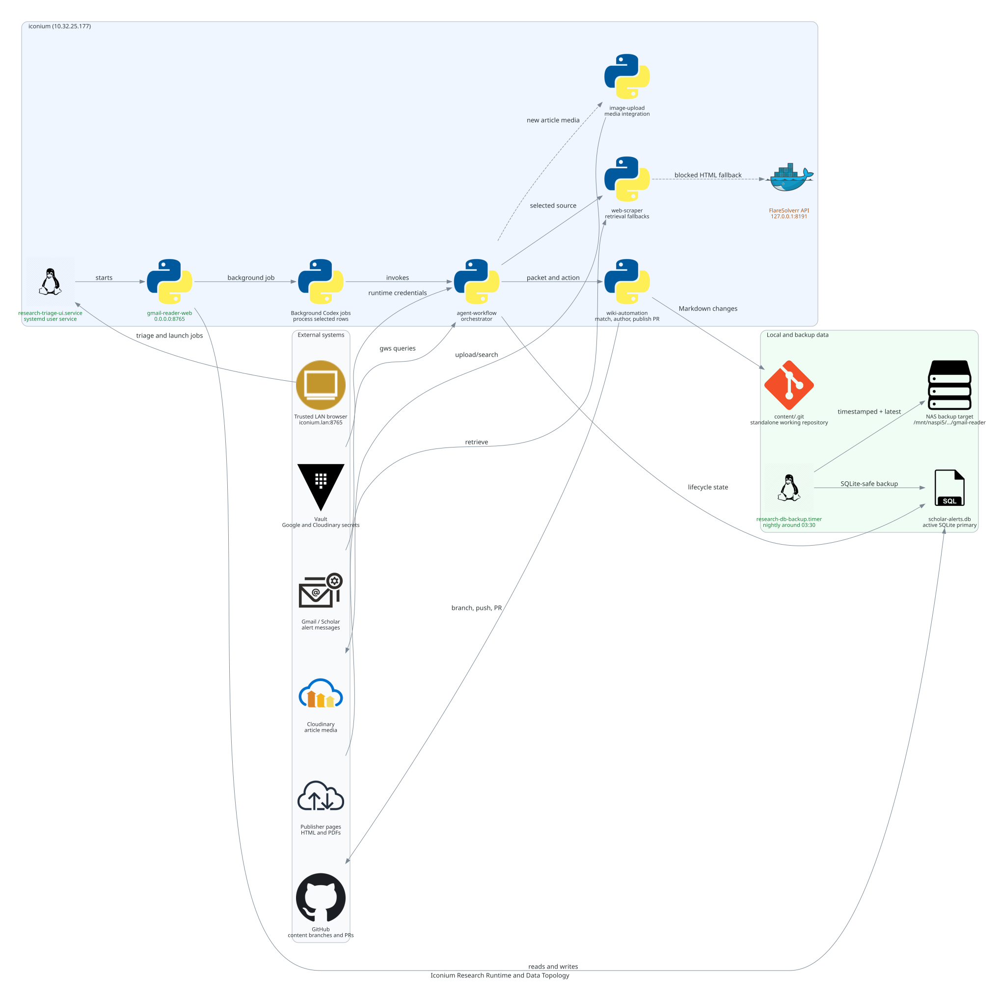

### Operator services and schedules

The observed active triage, llama.cpp, FlareSolverr, and backup components; the tracked-but-disabled Scholar/publisher timers; and their relationships to Gmail, SQLite, NAS, content, and operator controls.

[Open SVG](rendered/operator-services-and-schedules.svg) · [Open PNG](rendered/operator-services-and-schedules.png) · [Edit specification](specs/operator-services-and-schedules.yaml)

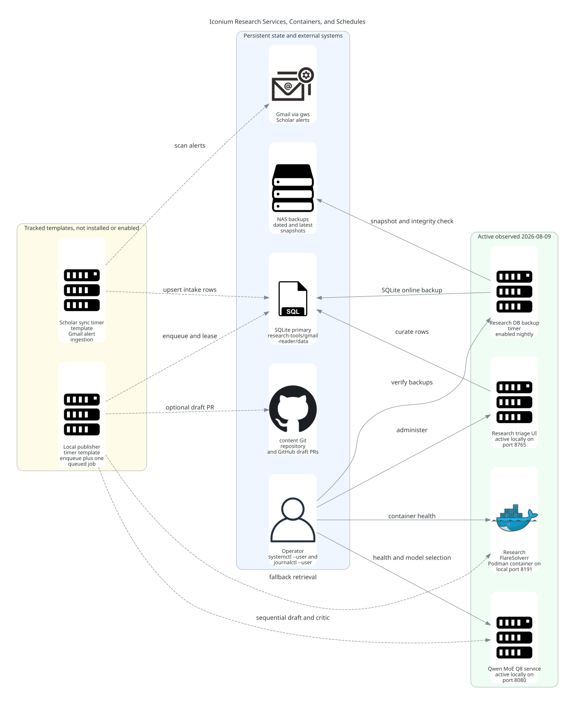

### Local llama.cpp stack integration

The structured draft/critic API calls from `local_publish.py` through the active OpenAI-compatible port, Qwen systemd unit, rootless ROCm Toolbx, model, and Strix Halo GPU, including mutually exclusive port-8080 alternatives.

[Open SVG](rendered/local-llm-stack-integration.svg) · [Open PNG](rendered/local-llm-stack-integration.png) · [Edit specification](specs/local-llm-stack-integration.yaml)

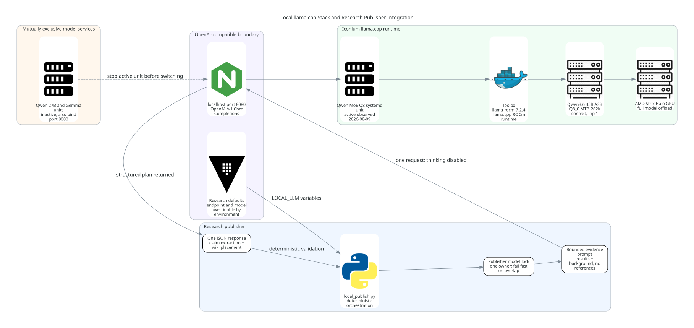

## Repository architecture views

### Research coordinator

The files owned by the coordinator, its flat-boundary CI guard, legacy migration mechanism, and ignored standalone workspace paths.

[Open SVG](rendered/research-coordinator-architecture.svg) · [Open PNG](rendered/research-coordinator-architecture.png) · [Edit specification](specs/research-coordinator-architecture.yaml)

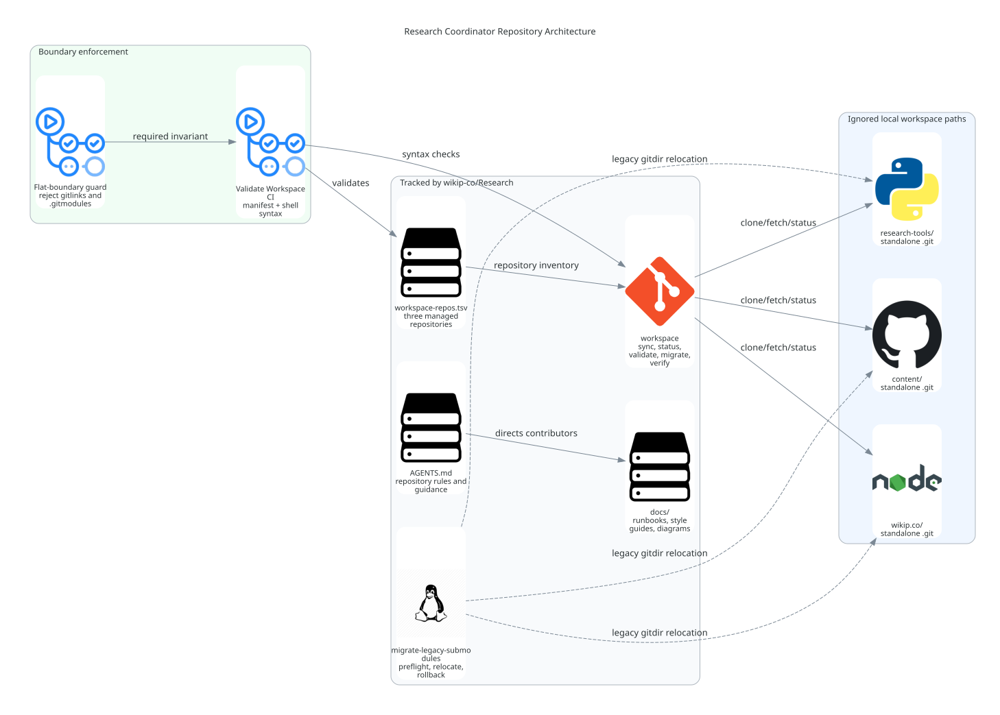

### Research-tools components and dependencies

The Python workspace packages, command orchestration, triage/runtime surfaces, external systems, content checkout, and generated runtime data.

[Open SVG](rendered/research-tools-component-architecture.svg) · [Open PNG](rendered/research-tools-component-architecture.png) · [Edit specification](specs/research-tools-component-architecture.yaml)

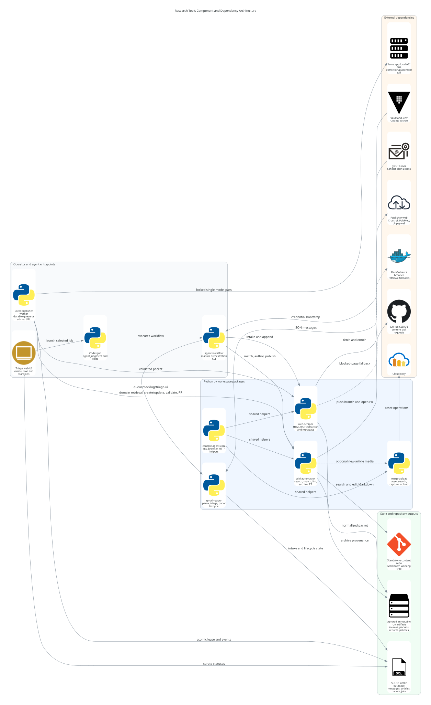

### Research-tools command map

The `agent-workflow` command families, the Python workspace package that owns each action, shared helpers, and the database, packet, media, patch, and PR outputs.

[Open SVG](rendered/research-tools-command-map.svg) · [Open PNG](rendered/research-tools-command-map.png) · [Edit specification](specs/research-tools-command-map.yaml)

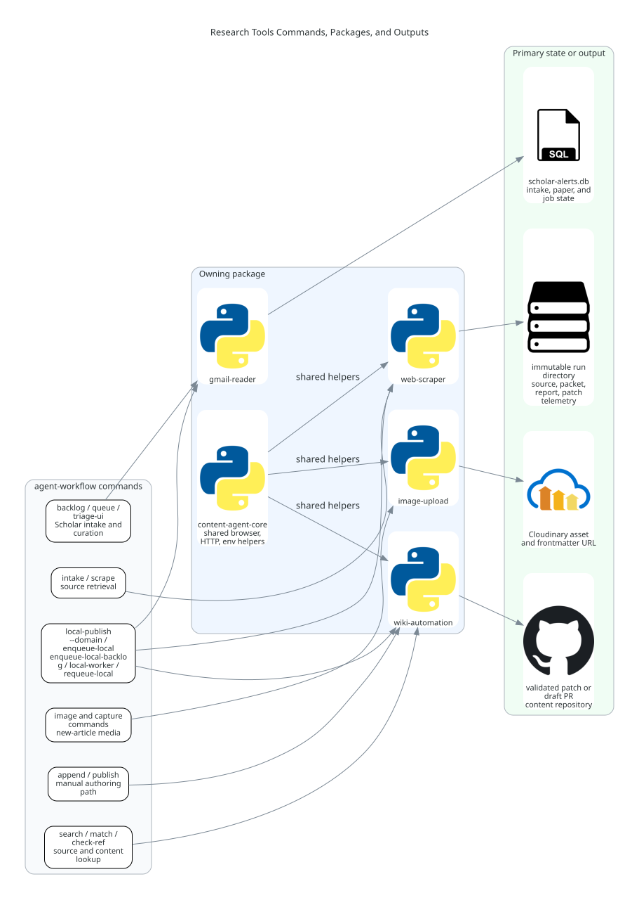

### Research-tools paper lifecycle

The canonical state progression from a discovered candidate through scrape, match, draft, commit, pull request, merge, archival provenance, and the corresponding `papers` record.

[Open SVG](rendered/research-tools-paper-lifecycle.svg) · [Open PNG](rendered/research-tools-paper-lifecycle.png) · [Edit specification](specs/research-tools-paper-lifecycle.yaml)

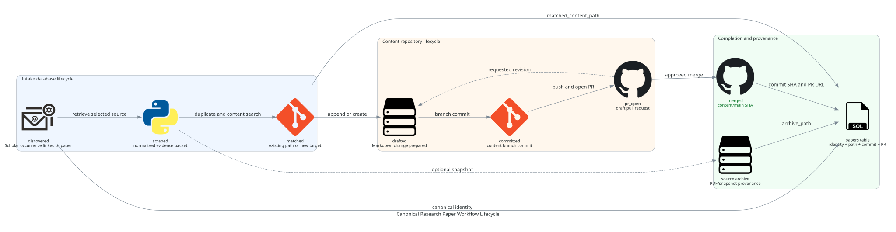

### Durable publication job lifecycle

The lease-based local queue from `queued` through processing, retry, human-review, rejection, duplicate, failure, and verified draft-PR outcomes, with its append-only event history.

[Open SVG](rendered/publication-job-lifecycle.svg) · [Open PNG](rendered/publication-job-lifecycle.png) · [Edit specification](specs/publication-job-lifecycle.yaml)

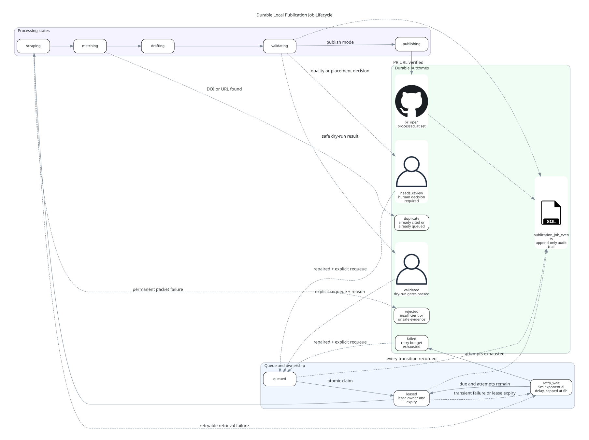

### Research database relationships

The intake, canonical paper, legacy Codex job, local publication queue, event history, and nightly backup relationships within the SQLite production database.

[Open SVG](rendered/research-database-schema.svg) · [Open PNG](rendered/research-database-schema.png) · [Edit specification](specs/research-database-schema.yaml)

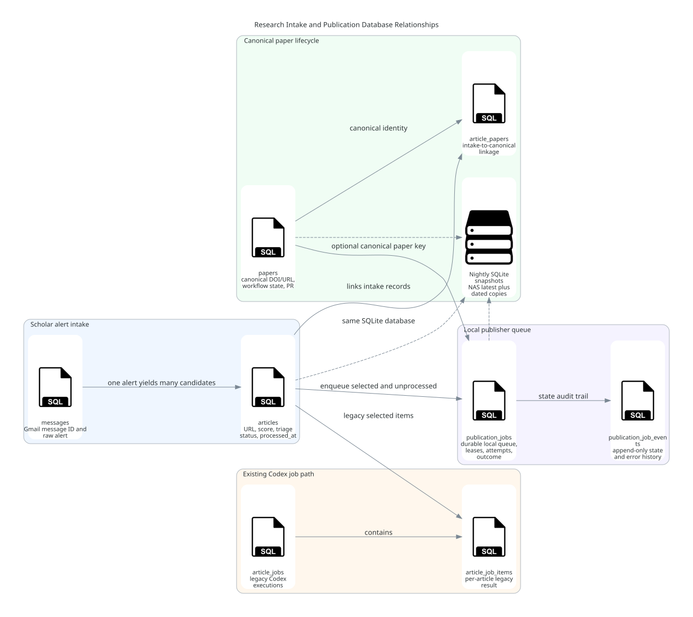

### Content repository

The Markdown category trees, article contract, authoring inputs, `content/main` ownership boundary, and rebuild-dispatch automation.

[Open SVG](rendered/content-repository-architecture.svg) · [Open PNG](rendered/content-repository-architecture.png) · [Edit specification](specs/content-repository-architecture.yaml)

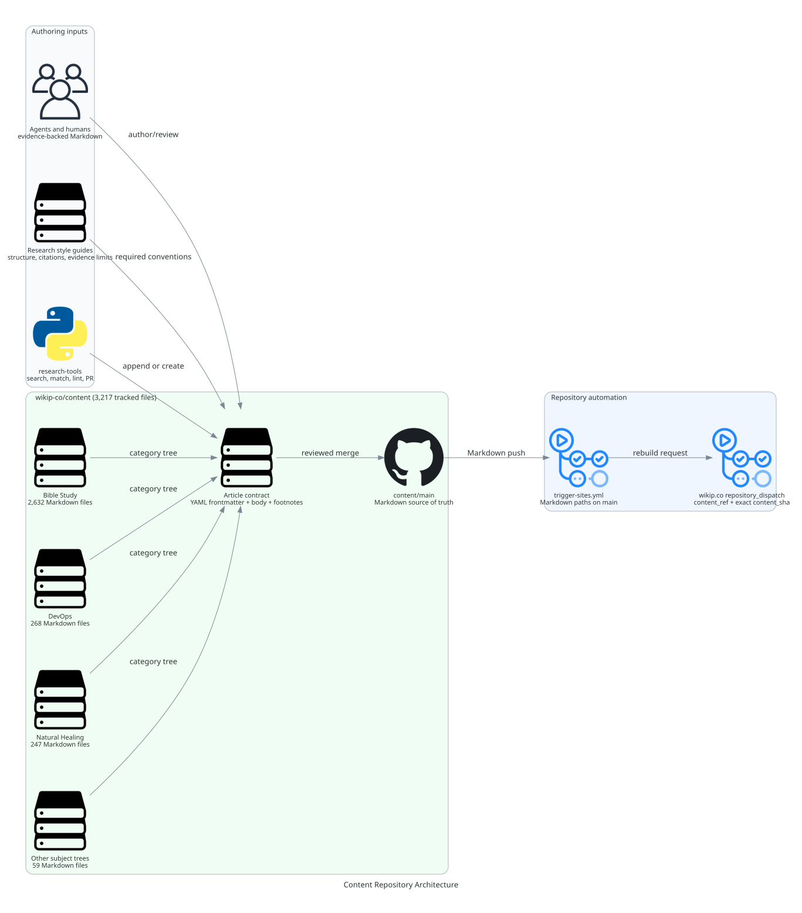

### Wikip.co site repository

The tracked Hexo application, ignored build-time inputs and outputs, content preparation, site generation, image build, and generated-site publication.

[Open SVG](rendered/wikip-site-repository-architecture.svg) · [Open PNG](rendered/wikip-site-repository-architecture.png) · [Edit specification](specs/wikip-site-repository-architecture.yaml)

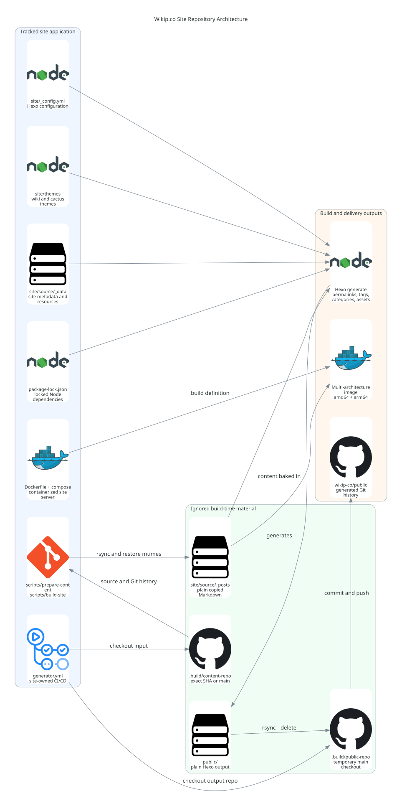

### Public generated-site repository

The automation-owned deployment repository, its generated artifacts, Cloudflare Pages consumer, and explicit prohibition on manual source editing.

[Open SVG](rendered/public-repository-architecture.svg) · [Open PNG](rendered/public-repository-architecture.png) · [Edit specification](specs/public-repository-architecture.yaml)

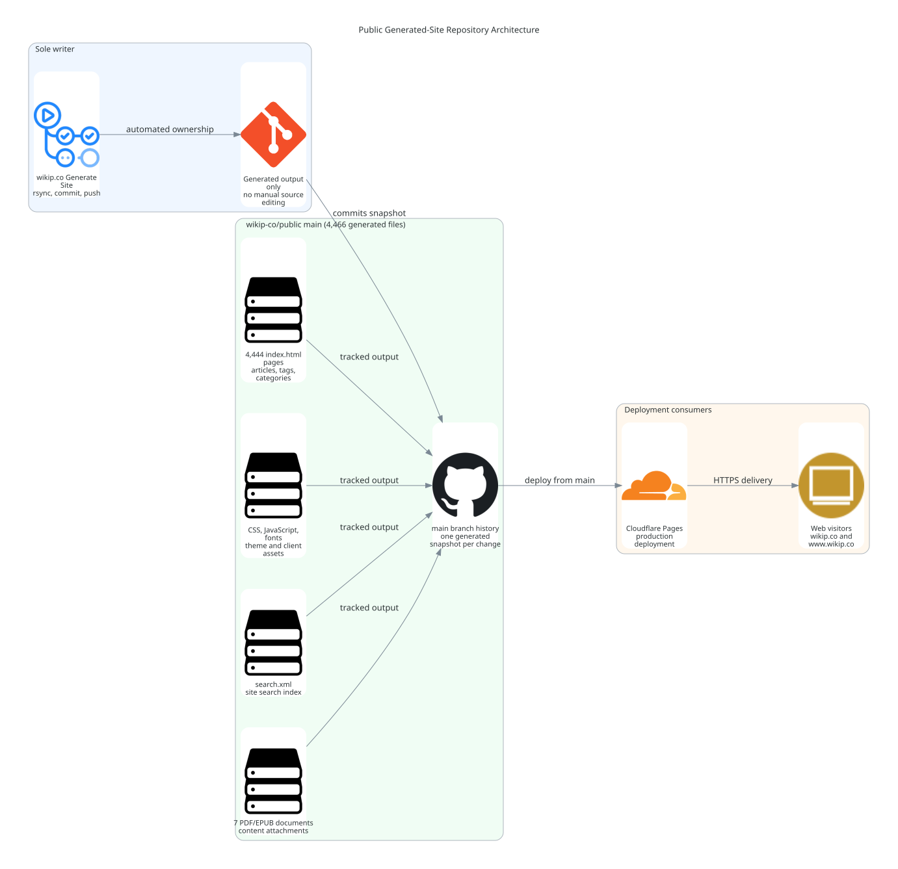

## Regenerating the diagrams

The renderer intentionally uses the separate [`diagram-generator`](https://github.com/anthonyrussano/diagram-generator) repository. By default it expects that checkout at `~/diagram-generator`.

```bash
docs/diagrams/render-diagrams
```

The wrapper is container-first and does not depend on host Python or Graphviz. Build or refresh the pinned generator image from its checkout with:

```bash
~/diagram-generator/scripts/build-container.sh
```

Override either location when needed:

```bash
DIAGRAM_GENERATOR_ROOT=/path/to/diagram-generator \
DIAGRAM_GENERATOR_IMAGE=diagram-gen:local \
docs/diagrams/render-diagrams
```

Commit the YAML specification and both rendered formats together. Inspect the PNG at full resolution after any layout change; a successful render does not guarantee readable edge routing.

Known reproducibility blind spot: PNG output is byte-stable across repeated
container renders, but the current generator/Graphviz SVG path embeds random
internal node identifiers. Consequently, semantically identical SVGs can have
different checksums even when their visible layout and PNG render are
unchanged. Review SVG diffs for identifier-only churn until the generator makes
those IDs deterministic.
